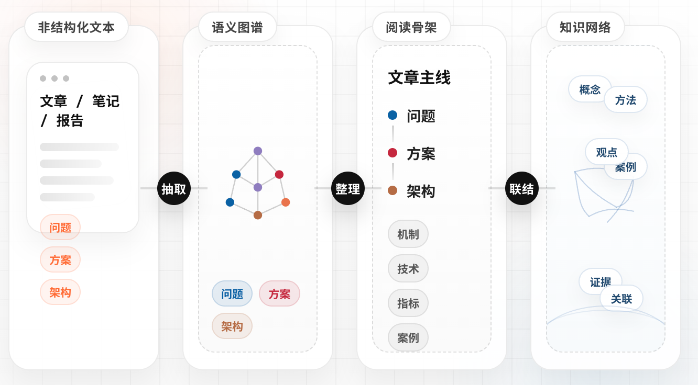
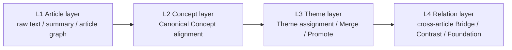
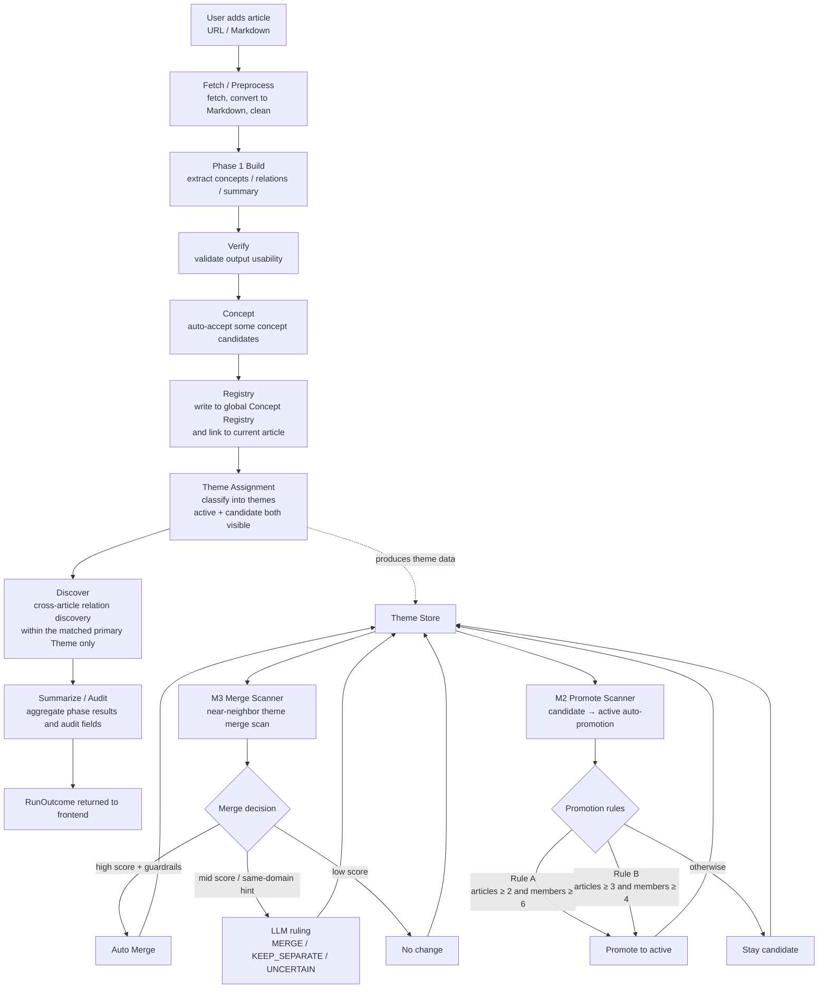

<div align="center">

# Knowledge Fabric

**A Knowledge Workspace for Research and Insight**

<em>Turn articles and documents into a browsable knowledge graph and workspace.</em>

[English](./README-EN.md) | [中文文档](./README.md)

</div>

## Overview

Knowledge Fabric imports articles or Markdown documents, builds a knowledge graph for each project, and lets you browse that knowledge in a workspace.

You can:

- Import articles or Markdown files
- Generate a knowledge graph and reading structure per project
- Browse project-level concepts, themes, and cross-article relations in a workspace
- Explore the global concept registry and theme hub

### System overview



The architecture unfolds across four core stages: extracting structure from text, organizing that structure into a reading skeleton, linking skeletons across articles, and growing a persistent knowledge network.

- **Unstructured text** — articles, notes, and reports enter the system as raw material, preserving original context and detail.
- **Semantic graph** — concepts and relationships are extracted from the text, turning scattered expressions into an actionable semantic structure.
- **Reading skeleton** — the article's core thread is surfaced, highlighting key nodes such as problems, solutions, and architecture, making content easier to navigate.
- **Knowledge network** — concepts, arguments, methods, and evidence across articles are linked together, accumulating into a traceable, extensible long-term knowledge asset.

> Knowledge Fabric is not about how much you store — it's about whether content can be woven into structure, structure distilled into a network, and that network turned into understanding.

## Architecture & pipeline

### Four-layer knowledge model



### Main processing pipeline



### Why not run cross-theme discovery for all theme pairs?

```mermaid
flowchart TD
    A[Why not do all-pairs Theme Discover now?] --> B[Cost becomes O&#40;N²&#41;]
    B --> C[As themes grow<br/>token usage and latency explode]
    C --> D[Current strategy:<br/>incremental Discover within same Theme only]
    D --> E[M2 / M3 governance consolidates knowledge<br/>into a small set of stable themes]
    E --> F[When truly needed, add P3:<br/>scan Top-K neighbor themes only, not all pairs]
```



The system uses **same-theme incremental discovery**: each pipeline run performs cross-article relation discovery only within the primary theme hit during that run. This avoids O(N²) full-pair scanning. Theme governance (M2 promote + M3 merge) continuously consolidates knowledge into fewer, stable themes — laying the groundwork for a future Top-K neighbor scan if broader coverage is needed.

## Current release

This repository is a **Preview** of Knowledge Fabric. Article ingestion, graph building, the project workspace, and global concept / theme browsing are usable today; some review and evolution views are still prototypes.

## Quick start

### Prerequisites

| Tool | Version | Check / install |
|------|---------|-----------------|
| Node.js | 18+ | `node -v` / <https://nodejs.org/> |
| Python | 3.11 – 3.12 | `python3 --version` |
| uv | latest | `curl -LsSf https://astral.sh/uv/install.sh \| sh` |
| Neo4j | 5.26+ | Docker one-liner below, or [Neo4j Desktop](https://neo4j.com/download/) |

Run a local Neo4j via Docker (easiest):

```bash
docker run -d \
  --name knowledge-fabric-neo4j \
  -p 7474:7474 -p 7687:7687 \
  -e NEO4J_AUTH=neo4j/graphiti123 \
  -v $HOME/neo4j-data:/data \
  neo4j:5.26
```

### 1. Clone and configure environment variables

```bash
git clone https://github.com/searchbb/knowledge-fabric.git
cd knowledge-fabric
cp .env.example .env
```

Edit `.env` — a minimum viable configuration:

```env
# LLM (OpenAI-compatible; any compatible gateway works)
LLM_API_KEY=sk-xxxxxxxx
LLM_BASE_URL=https://api.openai.com/v1
LLM_MODEL_NAME=gpt-4o-mini

# Neo4j
NEO4J_URI=bolt://localhost:7687
NEO4J_USER=neo4j
NEO4J_PASSWORD=graphiti123
```

See [`.env.example`](./.env.example) for the full template.

### 2. Install dependencies

```bash
npm run setup:all
```

> If you plan to use the reading-view screenshot feature, also run:
>
> ```bash
> cd backend && uv run playwright install chromium
> ```

### 3. Start

```bash
npm run dev
```

- Frontend: <http://localhost:3000>
- Backend API: <http://localhost:5001>

## Verify your first run

1. Open <http://localhost:3000/workspace/overview>. If the overview page loads, the frontend and the `/api/*` proxy are wired.
2. If the page reports Neo4j is not connected, check that the container in `docker ps` is running and that the password in `.env` matches the container.
3. From the import entry or the auto pipeline queue, paste a URL or upload a Markdown file and wait for the graph to build.
4. Once a project is created, open it to view the article graph, concepts, theme candidates, and cross-article relations inside the workspace.

## Main entry points

| Page | Path |
|------|------|
| Workspace overview | `/workspace/overview` |
| Concept registry | `/workspace/registry` |
| Theme hub | `/workspace/themes` |
| Project workspace | `/workspace/:projectId` |

## Docker deployment

```bash
cp .env.example .env
docker compose up -d --build
```

Reads `.env` from the project root and maps ports `3000` (frontend) / `5001` (backend).

The current `docker-compose.yml` only launches the app container — you still need a reachable Neo4j. Point `NEO4J_URI` at your instance (macOS / Windows can use `host.docker.internal:7687`).

## Running tests

Start with the subset that doesn't require external services:

```bash
cd backend
uv run pytest -q \
  --ignore=tests/test_graph_builder_normalization.py \
  --ignore=tests/test_theme_attach_detach_audit.py \
  --ignore=tests/test_e2e_registry_flows.py \
  --ignore=tests/test_evolution_log_api.py
```

Full suite (needs a live Neo4j and live LLM):

```bash
uv run pytest -q
```

## Common issues

| Symptom | Cause | Fix |
|---------|-------|-----|
| `npm run dev` fails with `port 3000 is already in use` | Port 3000 taken | Change `server.port` in `frontend/vite.config.js` and set `KNOWLEDGE_WORKSPACE_FRONTEND=http://localhost:<new>` in `.env` |
| Backend `ModuleNotFoundError: graphiti_core` | Python deps not installed | Make sure `uv sync` ran; start the backend with `uv run python run.py` (or activate `backend/.venv`) — not the system `python3` |
| Backend `ServiceUnavailable` from Neo4j | Neo4j not running or password mismatch | `docker ps \| grep neo4j`; if needed `docker logs knowledge-fabric-neo4j` |
| Reading-view screenshot `ERR_CONNECTION_REFUSED` | Frontend not on port 3000, or playwright browser missing | Make sure `npm run frontend` is up; run `cd backend && uv run playwright install chromium` |
| LLM 401 / 404 | `LLM_BASE_URL` / `LLM_MODEL_NAME` mismatched with key | Reconcile with your gateway's docs; OpenAI official is `https://api.openai.com/v1` + `gpt-4o-mini` |

## Known limitations

- Review and evolution views are still prototypes
- Some backend tests depend on a live Neo4j and a live LLM

## Feedback

Feedback via GitHub Issues / PRs is welcome.

## License

AGPL-3.0. See [LICENSE](./LICENSE).
