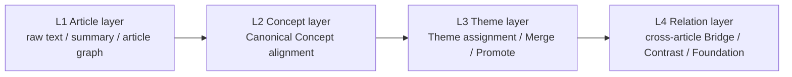
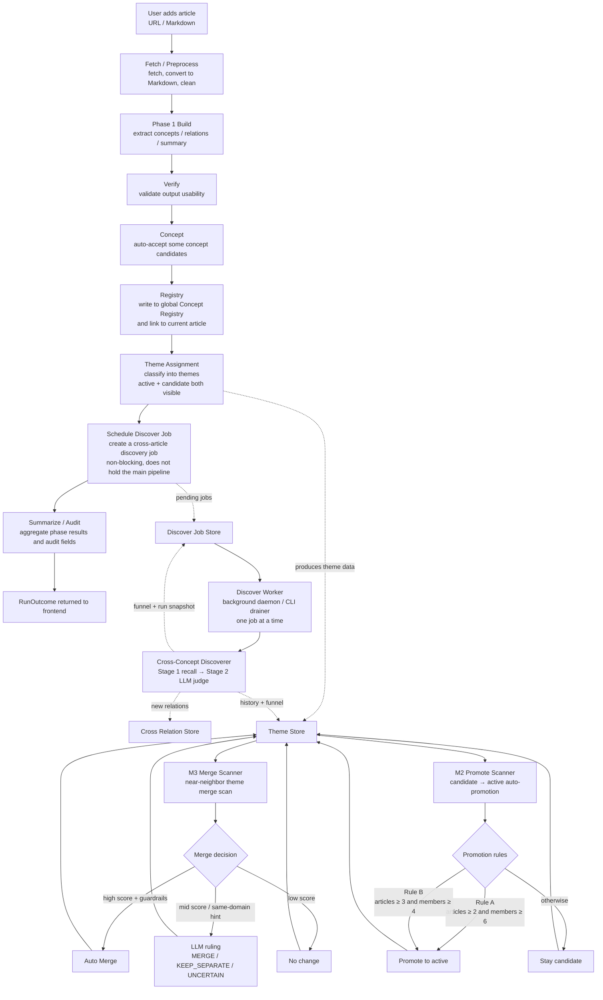
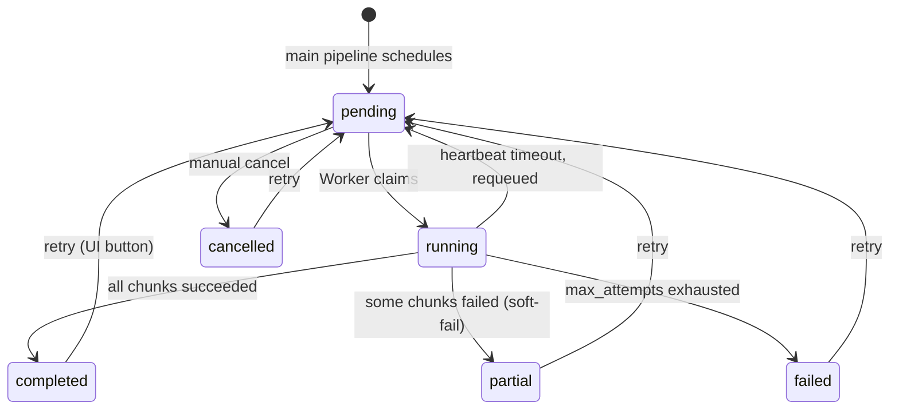

<div align="center">

# Knowledge Fabric

**A Knowledge Workspace for Research and Insight**

<em>Turn articles and documents into a browsable knowledge graph and workspace.</em>

[English](./README-EN.md) | [中文文档](./README.md)

**[Live Demo →](https://knowledge-fabric.vercel.app/)**

</div>

## Overview

Knowledge Fabric imports articles or Markdown documents, builds a knowledge graph for each project, and lets you browse that knowledge in a workspace.

You can:

- Import articles or Markdown files
- Generate a knowledge graph and reading structure per project
- Browse project-level concepts, themes, and cross-article relations in a workspace
- Explore the global concept registry and theme hub

### System overview


The architecture unfolds across four core stages: extracting structure from text, organizing that structure into a reading skeleton, linking skeletons across articles, and growing a persistent knowledge network.

- **Unstructured text** — articles, notes, and reports enter the system as raw material, preserving original context and detail.
- **Semantic graph** — concepts and relationships are extracted from the text, turning scattered expressions into an actionable semantic structure.
- **Reading skeleton** — the article's core thread is surfaced, highlighting key nodes such as problems, solutions, and architecture, making content easier to navigate.
- **Knowledge network** — concepts, arguments, methods, and evidence across articles are linked together, accumulating into a traceable, extensible long-term knowledge asset.

> Knowledge Fabric is not about how much you store — it's about whether content can be woven into structure, structure distilled into a network, and that network turned into understanding.

## Architecture & pipeline

### Four-layer knowledge model



### Main processing pipeline



> **Discover V2 (2026-04)**: After Theme Assignment, the main pipeline no longer calls the LLM synchronously to discover cross-article relations. Instead it writes a *discover job* to the Discover Job Store and returns immediately. The actual discovery runs asynchronously on a dedicated worker (or the `scripts/run_discover_jobs.py` CLI drainer). See the [Discover V2 — cross-article relation discovery](#discover-v2--cross-article-relation-discovery) section below for full details.

### Why not run cross-theme discovery for all theme pairs?

```mermaid
flowchart TD
    A[Why not do all-pairs Theme Discover now?] --> B[Cost becomes O&#40;N²&#41;]
    B --> C[As themes grow<br/>token usage and latency explode]
    C --> D[Current strategy:<br/>incremental Discover within same Theme only]
    D --> E[M2 / M3 governance consolidates knowledge<br/>into a small set of stable themes]
```



The system uses **same-theme incremental discovery**: each pipeline run performs cross-article relation discovery only within the primary theme hit during that run. This avoids O(N²) full-pair scanning. Theme governance (M2 promote + M3 merge) continuously consolidates knowledge into fewer, stable themes.

## Discover V2 — cross-article relation discovery

In V2, cross-article relation discovery moves from a **synchronous phase inside the main pipeline** to a **standalone background job system** with observability, rate-limiting, and an optional vector-based recall path. Key changes:

- The main pipeline no longer blocks on LLM judgement. After Theme Assignment it schedules a *discover job* and returns to the user.
- An independent Discover Worker (daemon or CLI) processes pending jobs one at a time.
- Stage 1 candidate recall supports two modes: **rules** (default) and **embedding** (requires a real embedding provider; auto-degrades with a marker when none is configured).
- Stage 2 LLM judgement auto-retries transient errors (connection / timeout / 5xx gateway); non-transient errors are not retried.
- Two soft gates — **daily budget** and **per-theme hourly cooldown** — log every block to a rolling file and surface it prominently in the UI.
- Every job, funnel, error, and relation provenance is auditable.

### Discover Job state machine



### Stage 1 recall modes

| Mode | How to enable | Notes |
|------|---------------|-------|
| Rules (default) | None | Enumerate all cross-article pairs, score by type complementarity + description token overlap; dedupe keys preloaded into a single set (P1.5 optimisation) |
| Embedding | `DISCOVER_RECALL_MODE=embedding` + real provider | For each new concept, top-K nearest-neighbour search within the same theme (default K=20); reapply the same hard filters (cross-article, dedupe); rerank with the same light-rule score |

**Safety gate**: when `DISCOVER_RECALL_MODE=embedding` is set but no production provider is wired (today only `DeterministicEmbeddingProvider` exists as a test double), dispatch **auto-degrades to rules mode** and stamps `fallback_to_rules=true` in the funnel. Set `DISCOVER_ALLOW_FALLBACK_EMBEDDING=1` to explicitly opt into the deterministic fallback for local dev. Runtime exceptions from the embedding call are caught and degraded the same way.

### Rate-limit & observability

- **Per-theme cooldown**: `DISCOVER_THEME_HOURLY_CAP` (default `10`) — max jobs created for the same theme per hour
- **Global daily budget**: `DISCOVER_DAILY_JOB_BUDGET` (default `50`) — max jobs per calendar day across all themes
- **Blocked events** are appended to `data/discover-skips.json` (rolling, 50 entries) and surfaced in the Discover panel as an amber alert: "N schedules throttled in the last hour / cooldown X / budget Y"
- **Job funnel** flows through the entire chain: raw_pairs → after_incremental_gate → after_cross_article → after_dedupe_filter → sent_to_llm → llm_accepted → committed
- **Relation provenance**: every auto-created cross-relation carries `run_id` + `job_id`, supporting per-job traceback
- **Theme history**: each theme keeps the last 10 discover runs (with funnels) for trend comparison

### Discover V2 environment variables

| Variable | Default | Meaning |
|----------|---------|---------|
| `AUTO_START_DISCOVER_WORKER` | `0` | Set to `1` and `create_app()` starts the background Discover Worker daemon |
| `DISCOVER_WORKER_IDLE_SECONDS` | `5` | Worker idle poll interval |
| `DISCOVER_RECALL_MODE` | `rules` | `rules` or `embedding`; embedding requires a real provider or the opt-in below |
| `DISCOVER_ALLOW_FALLBACK_EMBEDDING` | `0` | Set to `1` to allow the `DeterministicEmbeddingProvider` to run in embedding mode (testing / local dev) |
| `DISCOVER_THEME_HOURLY_CAP` | `10` | Per-theme per-hour job cap; `0` disables |
| `DISCOVER_DAILY_JOB_BUDGET` | `50` | Per-day global job cap; `0` disables |

### CLI tools

Drain the queue manually:

```bash
cd backend
uv run python scripts/run_discover_jobs.py --list          # queue snapshot
uv run python scripts/run_discover_jobs.py                 # drain until empty
uv run python scripts/run_discover_jobs.py --max 5         # at most 5 jobs
uv run python scripts/run_discover_jobs.py --recover-stale # requeue heartbeat-stale running jobs
```

### REST API

| Method | Path | Purpose |
|--------|------|---------|
| `GET` | `/api/auto/discover-jobs/stats` | Status counts |
| `GET` | `/api/auto/discover-jobs?status=...&limit=N` | List (filterable) |
| `GET` | `/api/auto/discover-jobs/<job_id>` | Single job detail (includes funnel / errors) |
| `GET` | `/api/auto/discover-jobs/by-theme/<theme_id>` | Theme-level aggregate (history + jobs) |
| `GET` | `/api/auto/discover-jobs/by-project/<project_id>` | Project/article-level aggregate |
| `GET` | `/api/auto/discover-jobs/recent-skips?within_seconds=3600` | Recent throttle events |
| `POST` | `/api/auto/discover-jobs/run-once` | Run one pending job synchronously (manual drain) |
| `POST` | `/api/auto/discover-jobs/recover-stale` | Requeue heartbeat-stale running jobs |
| `POST` | `/api/auto/discover-jobs/<job_id>/retry` | Move a terminal (partial/failed/cancelled) job back to pending |
| `POST` | `/api/auto/discover-jobs/<job_id>/cancel` | Cancel a pending job |

### Frontend surfaces

- **Auto pipeline `/workspace/auto`**: Discover queue panel (counters + attention-worthy jobs + throttle alert + click-through to job detail drawer)
- **Discover queue `/workspace/discover`**: Standalone global job listing page (filters + inline retry/cancel + detail drawer)
- **Theme hub `/workspace/themes/<theme_id>`**: Sidebar surfaces the theme's discover history + per-status counts

### Data files

Discover V2 keeps four independent JSON sidecars (all under `backend/data/`):

| File | Contents |
|------|----------|
| `discover-jobs.json` | Lifecycle records for every discover job |
| `discover-skips.json` | Rolling log of cooldown/budget-blocked schedules (50 entries) |
| `concept_embeddings.json` | Concept vector cache (lazy-generate + text_hash-based invalidation) |
| `cross_concept_relations.json` | Persisted cross-article relations (with `run_id` + `job_id` provenance) |

## Current release

This repository is a **Preview** of Knowledge Fabric. Article ingestion, graph building, the project workspace, and global concept / theme browsing are usable today; some review and evolution views are still prototypes.

## Quick start

### Prerequisites

| Tool | Version | Check / install |
|------|---------|-----------------|
| Node.js | 18+ | `node -v` / <https://nodejs.org/> |
| Python | 3.11 – 3.12 | `python3 --version` |
| uv | latest | `curl -LsSf https://astral.sh/uv/install.sh \| sh` |
| Neo4j | 5.26+ | Docker one-liner below, or [Neo4j Desktop](https://neo4j.com/download/) |

Run a local Neo4j via Docker (easiest):

```bash
docker run -d \
  --name knowledge-fabric-neo4j \
  -p 7474:7474 -p 7687:7687 \
  -e NEO4J_AUTH=neo4j/graphiti123 \
  -v $HOME/neo4j-data:/data \
  neo4j:5.26
```

### 1. Clone and configure environment variables

```bash
git clone https://github.com/searchbb/knowledge-fabric.git
cd knowledge-fabric
cp .env.example .env
```

Edit `.env` — a minimum viable configuration:

```env
# LLM (OpenAI-compatible; any compatible gateway works)
LLM_API_KEY=sk-xxxxxxxx
LLM_BASE_URL=https://api.openai.com/v1
LLM_MODEL_NAME=gpt-4o-mini

# Neo4j
NEO4J_URI=bolt://localhost:7687
NEO4J_USER=neo4j
NEO4J_PASSWORD=graphiti123
```

See [`.env.example`](./.env.example) for the full template.

### 2. Install dependencies

```bash
npm run setup:all
```

> If you plan to use the reading-view screenshot feature, also run:
>
> ```bash
> cd backend && uv run playwright install chromium
> ```

### 3. Start

```bash
npm run dev
```

- Frontend: <http://localhost:3000>
- Backend API: <http://localhost:5001>

## Verify your first run

1. Open <http://localhost:3000/workspace/overview>. If the overview page loads, the frontend and the `/api/*` proxy are wired.
2. If the page reports Neo4j is not connected, check that the container in `docker ps` is running and that the password in `.env` matches the container.
3. From the import entry or the auto pipeline queue, paste a URL or upload a Markdown file and wait for the graph to build.
4. Once a project is created, open it to view the article graph, concepts, theme candidates, and cross-article relations inside the workspace.

## Main entry points

| Page | Path |
|------|------|
| Workspace overview | `/workspace/overview` |
| Concept registry | `/workspace/registry` |
| Theme hub | `/workspace/themes` |
| Project workspace | `/workspace/:projectId` |
| Auto pipeline | `/workspace/auto` |
| Discover queue | `/workspace/discover` |

## Docker deployment

```bash
cp .env.example .env
docker compose up -d --build
```

Reads `.env` from the project root and maps ports `3000` (frontend) / `5001` (backend).

The current `docker-compose.yml` only launches the app container — you still need a reachable Neo4j. Point `NEO4J_URI` at your instance (macOS / Windows can use `host.docker.internal:7687`).

## Running tests

Start with the subset that doesn't require external services:

```bash
cd backend
uv run pytest -q \
  --ignore=tests/test_graph_builder_normalization.py \
  --ignore=tests/test_graph_builder_e2e.py \
  --ignore=tests/test_theme_attach_detach_audit.py \
  --ignore=tests/test_evolution_view_api.py \
  --ignore=tests/test_theme_panorama_integration.py \
  --ignore=tests/test_article_workspace_pipeline.py \
  --ignore=tests/test_graph_api_build.py \
  --ignore=tests/test_bench_bailian_concurrency.py \
  --ignore=tests/test_extraction_benchmark.py \
  --ignore=tests/test_openclaw_log_monitor.py \
  --ignore=tests/test_e2e_registry_flows.py \
  --ignore=tests/test_evolution_log_api.py
```

Full suite (needs a live Neo4j and live LLM):

```bash
uv run pytest -q
```

## Common issues

| Symptom | Cause | Fix |
|---------|-------|-----|
| `npm run dev` fails with `port 3000 is already in use` | Port 3000 taken | Change `server.port` in `frontend/vite.config.js` and set `KNOWLEDGE_WORKSPACE_FRONTEND=http://localhost:<new>` in `.env` |
| Backend `ModuleNotFoundError: graphiti_core` | Python deps not installed | Make sure `uv sync` ran; start the backend with `uv run python run.py` (or activate `backend/.venv`) — not the system `python3` |
| Backend `ServiceUnavailable` from Neo4j | Neo4j not running or password mismatch | `docker ps \| grep neo4j`; if needed `docker logs knowledge-fabric-neo4j` |
| Reading-view screenshot `ERR_CONNECTION_REFUSED` | Frontend not on port 3000, or playwright browser missing | Make sure `npm run frontend` is up; run `cd backend && uv run playwright install chromium` |
| LLM 401 / 404 | `LLM_BASE_URL` / `LLM_MODEL_NAME` mismatched with key | Reconcile with your gateway's docs; OpenAI official is `https://api.openai.com/v1` + `gpt-4o-mini` |

## Known limitations

- Review and evolution views are still prototypes
- Some backend tests depend on a live Neo4j and a live LLM

## Feedback

Feedback via GitHub Issues / PRs is welcome.

## License

AGPL-3.0. See [LICENSE](./LICENSE).
