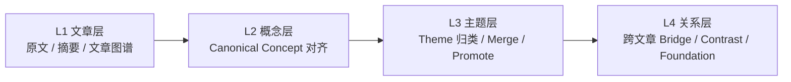
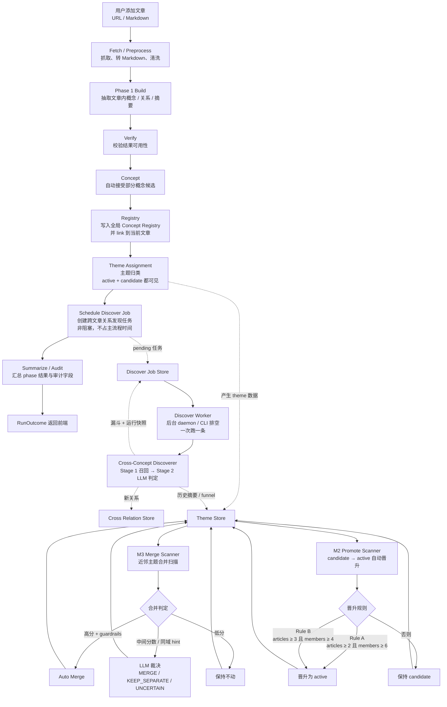
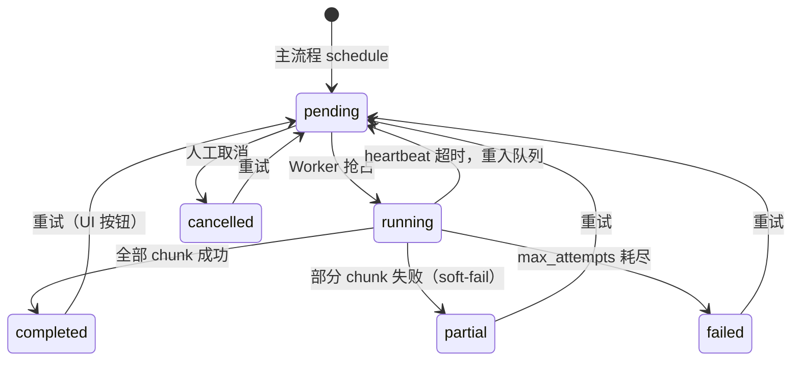

<div align="center">

# Knowledge Fabric Center

**A Knowledge Workspace for Research and Insight**

<em>把文章和文档变成可浏览的知识图谱与知识工作台</em>

[English](./README-EN.md) | [中文文档](./README.md)

**[在线 Demo →](https://knowledge-fabric.vercel.app/)**

</div>

## 简介

Knowledge Fabric Center 是一个将文章或 Markdown 文档导入后，为其构建知识图谱、并在工作台中浏览项目知识的系统。

它可以：

- 导入文章或 Markdown 文档
- 为每个项目生成知识图谱和阅读结构
- 在工作台中浏览项目内的概念、主题和跨文关系
- 查看全局概念注册表与主题枢纽

### 整体架构一览


整体架构围绕四个核心阶段展开：从文本中抽取结构，在结构中整理主线，在主线之间建立联结，最终形成可持续生长的知识网络。

- **非结构化文本**：文章、笔记、报告等原始材料进入系统，保留真实语境与信息细节。
- **语义图谱**：系统从文本中抽取概念及其关系，将零散表述转化为可操作的语义结构。
- **阅读骨架**：进一步整理文章的核心脉络，突出问题、方案、架构等关键节点，让内容更易理解。
- **知识网络**：将不同文章中的概念、观点、方法与证据联结起来，沉淀为可追溯、可扩展的长期知识资产。

> Knowledge Fabric Center 关注的不是”存了多少内容”，而是能否把内容编织成结构，把结构沉淀为网络，把网络转化为认知。

## 系统架构与处理流程

### 四层知识模型



### 主处理流水线



> **Discover V2（2026-04）**：主流程完成 Theme Assignment 之后不再同步调用 LLM 做跨文章关系发现，而是在 Discover Job Store 里落一条待办记录，立即返回。发现工作由独立的 Discover Worker（或 `scripts/run_discover_jobs.py` 手动排空）异步完成。详见下方 [Discover V2 — 跨文章关系发现](#discover-v2--跨文章关系发现)。

### 为什么不对所有主题两两做关系发现？

```mermaid
flowchart TD
    A[为什么现在不做'所有 Theme 两两 Discover'？] --> B[因为成本会变成 O&#40;N²&#41;]
    B --> C[Theme 多了以后<br/>token 与延迟都会爆]
    C --> D[当前策略：<br/>只在同 Theme 内增量 Discover]
    D --> E[先靠 M2 / M3 把知识尽量收拢到少量稳定 Theme]
```



当前采用**同主题增量发现**策略：每次处理时只在本次命中的主 Theme 内，对同主题的已有文章做跨文章关系发现。这避免了 O(N²) 的全量主题对扫描。主题治理（M2 晋升 + M3 合并）会持续把知识收拢到少量稳定主题。

## Discover V2 — 跨文章关系发现

跨文章关系发现（Discover）在 V2 里从**主流程里的同步阶段**变成了**独立的后台作业系统**，并增加了观测、限流、可选的向量召回等能力。关键点：

- 主流程不再同步等 LLM 判定完成；只在 Theme 归类成功后落一条 *discover job*，立即返回给用户
- 独立的 Discover Worker（daemon 或 CLI）按顺序把 pending 任务处理完
- Stage 1 候选召回支持两种模式：**规则模式**（默认）和**向量召回模式**（需要真实 embedding provider；未配置时拒绝启用并自动降级）
- Stage 2 LLM 判定对瞬态错误（connection error / timeout / 5xx gateway）自动重试，非瞬态错误不重试
- 自带**每日预算**和**单主题每小时冷却**两道软门禁，被拦截时会记入滚动日志，UI 显著提示
- 所有 job、漏斗（funnel）、错误、关系来源都可审计

### Discover Job 状态机



### Stage 1 召回模式

| 模式 | 启用方式 | 说明 |
|------|---------|------|
| 规则（默认） | 无 | 枚举所有跨文章 pair，跑类型互补 + token 重叠的打分；dedupe keys 一次性预加载成 set（P1.5 优化） |
| 向量召回 | `DISCOVER_RECALL_MODE=embedding` + 真实 provider | 对每个新概念在同主题内做 top-K 近邻检索（默认 K=20），再过相同的硬规则（跨文章、dedupe），用轻规则做 rerank |

**安全阀**：当启用 `DISCOVER_RECALL_MODE=embedding` 但找不到真实 embedding provider（目前只有 `DeterministicEmbeddingProvider` 测试实现）时，dispatch **自动降级到规则模式**并在 funnel 里标 `fallback_to_rules=true`。如果希望在开发环境用确定性 provider 跑一遍，可设 `DISCOVER_ALLOW_FALLBACK_EMBEDDING=1` 显式绕过。同样地，运行时 embedding 调用抛异常也会被 catch 并降级。

### 限流与可观测性

- **单主题冷却**：`DISCOVER_THEME_HOURLY_CAP`（默认 `10`）限制同一主题每小时创建的 discover job 数
- **全局日预算**：`DISCOVER_DAILY_JOB_BUDGET`（默认 `50`）限制全系统单日 job 数
- **被拦截事件**都会写入 `data/discover-skips.json` 滚动日志（最多 50 条），前端在 AutoPipelinePage 的 Discover 面板以琥珀色 alert 呈现："过去 1 小时有 N 次调度被拦截 / 主题冷却 X / 日预算 Y"
- **Job 漏斗**（funnel）贯穿整条链路：raw_pairs → after_incremental_gate → after_cross_article → after_dedupe_filter → sent_to_llm → llm_accepted → committed
- **Relation provenance**：每条自动创建的跨文关系都带 `run_id` + `job_id`，支持按 job 追溯
- **Theme 历史**：每个主题保留最近 10 次 discover 运行的摘要（含 funnel），供趋势对比

### Discover V2 环境变量

| 变量 | 默认 | 说明 |
|------|------|------|
| `AUTO_START_DISCOVER_WORKER` | `0` | 设为 `1` 时 `create_app()` 启动后台 Discover Worker daemon |
| `DISCOVER_WORKER_IDLE_SECONDS` | `5` | Worker 空轮询间隔 |
| `DISCOVER_RECALL_MODE` | `rules` | `rules` 或 `embedding`；embedding 需要真实 provider 或下面这个 opt-in |
| `DISCOVER_ALLOW_FALLBACK_EMBEDDING` | `0` | 设为 `1` 允许用 `DeterministicEmbeddingProvider` 跑 embedding 模式（测试/本地） |
| `DISCOVER_THEME_HOURLY_CAP` | `10` | 单主题每小时 job 数上限；`0` 禁用 |
| `DISCOVER_DAILY_JOB_BUDGET` | `50` | 全系统每天 job 数上限；`0` 禁用 |

### CLI 工具

手动排空队列：

```bash
cd backend
uv run python scripts/run_discover_jobs.py --list          # 看队列快照
uv run python scripts/run_discover_jobs.py                 # 排空到队列为空
uv run python scripts/run_discover_jobs.py --max 5         # 最多跑 5 条
uv run python scripts/run_discover_jobs.py --recover-stale # 把心跳超时的 running 重置回 pending
```

### REST API

| 方法 | 路径 | 用途 |
|------|------|------|
| `GET` | `/api/auto/discover-jobs/stats` | 状态计数 |
| `GET` | `/api/auto/discover-jobs?status=...&limit=N` | 列表（可筛选）|
| `GET` | `/api/auto/discover-jobs/<job_id>` | 单 job 详情（含 funnel / errors） |
| `GET` | `/api/auto/discover-jobs/by-theme/<theme_id>` | 主题级聚合视图（历史 + 相关 jobs） |
| `GET` | `/api/auto/discover-jobs/by-project/<project_id>` | 文章级聚合视图 |
| `GET` | `/api/auto/discover-jobs/recent-skips?within_seconds=3600` | 被限流拦截的最近事件 |
| `POST` | `/api/auto/discover-jobs/run-once` | 同步跑一条 pending（手动排空）|
| `POST` | `/api/auto/discover-jobs/recover-stale` | 恢复心跳超时的 running |
| `POST` | `/api/auto/discover-jobs/<job_id>/retry` | 把终态（partial/failed/cancelled）回到 pending |
| `POST` | `/api/auto/discover-jobs/<job_id>/cancel` | 取消 pending |

### 前端入口

- **自动处理 `/workspace/auto`**：Discover 队列面板（统计 + 需关注的任务 + 被限流 alert + 点进去看详情抽屉）
- **Discover 队列 `/workspace/discover`**：独立的全局 job 列表页（筛选 + 批量操作 + 详情抽屉）
- **主题枢纽 `/workspace/themes/<theme_id>`**：主题侧栏展示该主题的 discover 历史 + job 状态

## 富文本粘贴入口（2026-04-20 新增）

AutoPipelinePage 除了接受 URL，还支持从任意位置（微信 / 推特 / 飞书 / 剪贴板）粘贴一段富文本或图片。前端通过 Turndown + turndown-plugin-gfm 把 HTML 转成 Markdown，后端按**内容哈希**存到 `backend/data/notes/<hash>.md`，然后走 `PendingUrlStore.add_pending(md_path=...)` 复用 URL 文章一模一样的抽取管线（graph → concept → theme → discover）。

- 入口：`/workspace/auto` 页面 URL 输入框下方的"从文字/富文本创建笔记"卡片
- API：`POST /api/auto/pending-notes`，body `{title, markdown, allow_duplicate?}`
- 去重：内容 hash 相同 → 文件路径相同 → fingerprint 相同 → 自动判重
- 图片：v1 只保留为 base64 data URL 内嵌在 MD 里，**不参与**抽取（OCR / 视觉 LLM 留给下一轮迭代）

### 数据文件

Discover V2 自带四个独立的 JSON sidecar（均位于 `backend/data/`）：

| 文件 | 内容 |
|------|------|
| `discover-jobs.json` | 所有 discover jobs 的生命周期记录 |
| `discover-skips.json` | 被 cooldown/budget 拦截的滚动日志（50 条）|
| `concept_embeddings.json` | 概念向量缓存（懒生成 + text_hash 失效）|
| `cross_concept_relations.json` | 落库的跨文章关系（带 `run_id` + `job_id` provenance）|

## 当前版本

当前仓库是 Knowledge Fabric Center 的 **Preview 版本**。文章导入、图谱构建、项目工作台，以及全局概念 / 主题浏览已可用；部分审核与演化页面仍是原型。

## 快速开始

### 前置要求

| 工具 | 版本 | 检查 / 安装 |
|------|------|-------------|
| Node.js | 18+ | `node -v` / <https://nodejs.org/> |
| Python | 3.11 – 3.12 | `python3 --version` |
| uv | 最新 | `curl -LsSf https://astral.sh/uv/install.sh \| sh` |
| Neo4j | 5.26+ | 下方 Docker 一键启动，或 [Neo4j Desktop](https://neo4j.com/download/) |

启动一个本地 Neo4j（Docker 最简单）：

```bash
docker run -d \
  --name knowledge-fabric-neo4j \
  -p 7474:7474 -p 7687:7687 \
  -e NEO4J_AUTH=neo4j/graphiti123 \
  -v $HOME/neo4j-data:/data \
  neo4j:5.26
```

### 1. 克隆并配置环境变量

```bash
git clone https://github.com/searchbb/knowledge-fabric.git
cd knowledge-fabric
cp .env.example .env
```

编辑 `.env`，最小可运行配置：

```env
# 百炼（DashScope OpenAI 兼容）
BAILIAN_API_KEY=sk-xxxxxxxx
BAILIAN_BASE_URL=https://dashscope.aliyuncs.com/compatible-mode/v1
BAILIAN_MODEL_NAME=qwen3.5-plus
LLM_MODE_DEFAULT=bailian

# Neo4j
NEO4J_URI=bolt://localhost:7687
NEO4J_USER=neo4j
NEO4J_PASSWORD=graphiti123
```

完整字段见 [`.env.example`](./.env.example)。

### 2. 安装依赖

```bash
npm run setup:all
```

> 如果需要「阅读视图截图」功能，额外执行：
>
> ```bash
> cd backend && uv run playwright install chromium
> ```

### 3. 启动

```bash
npm run dev
```

- 前端：<http://localhost:3000>
- 后端 API：<http://localhost:5001>

## 验证首次成功运行

1. 打开 <http://localhost:3000/workspace/overview>，能看到工作台总览页即说明前端与 `/api/*` 代理已就绪。
2. 如果页面提示 Neo4j 未连接，检查 `docker ps` 中 Neo4j 容器是否在跑、`.env` 里的口令是否和容器一致。
3. 在导入入口或自动处理队列粘贴一个 URL，或上传一份 Markdown，等待图谱生成。
4. 项目生成后，进入该项目即可在工作台中查看文章图谱、概念、主题候选与跨文关系。

## 主要入口

| 页面 | 路径 |
|------|------|
| 工作台总览 | `/workspace/overview` |
| 概念注册表 | `/workspace/registry` |
| 主题枢纽 | `/workspace/themes` |
| 项目工作台 | `/workspace/:projectId` |
| 自动处理 | `/workspace/auto` |
| Discover 队列 | `/workspace/discover` |

## Docker 部署

```bash
cp .env.example .env
docker compose up -d --build
```

默认读取根目录 `.env`，映射 `3000`（前端）/ `5001`（后端）。

当前 `docker-compose.yml` 只启动应用容器，Neo4j 仍需你自行准备，并在 `NEO4J_URI` 中指向它（macOS / Windows 可使用 `host.docker.internal:7687`）。

## 运行测试

推荐先跑不依赖外部服务的子集：

```bash
cd backend
uv run pytest -q \
  --ignore=tests/test_graph_builder_normalization.py \
  --ignore=tests/test_graph_builder_e2e.py \
  --ignore=tests/test_theme_attach_detach_audit.py \
  --ignore=tests/test_e2e_registry_flows.py \
  --ignore=tests/test_evolution_log_api.py \
  --ignore=tests/test_evolution_view_api.py \
  --ignore=tests/test_theme_panorama_integration.py \
  --ignore=tests/test_article_workspace_pipeline.py \
  --ignore=tests/test_graph_api_build.py \
  --ignore=tests/test_bench_bailian_concurrency.py \
  --ignore=tests/test_extraction_benchmark.py \
  --ignore=tests/test_openclaw_log_monitor.py
```

说明：上面排除的测试分两类——一类依赖真实 Neo4j（`graphiti_core` 会在创建索引时连 `localhost:7687`），另一类依赖联网的 LLM / 真实后端。当环境具备这些服务时去掉对应的 `--ignore`。

前端测试：

```bash
cd frontend
npm test
```

完整测试（需要真实 Neo4j 和 LLM 在线调用）：

```bash
cd backend && uv run pytest -q
```

## 常见问题

| 现象 | 原因 | 处理 |
|------|------|------|
| 前端 `port 3000 is already in use` | 3000 端口被占用 | 修改 `frontend/vite.config.js` 的 `server.port`，并在 `.env` 设置 `KNOWLEDGE_WORKSPACE_FRONTEND=http://localhost:<新端口>` |
| 后端 `ModuleNotFoundError: graphiti_core` | Python 依赖未安装 | 确认 `uv sync` 已执行；启动用 `uv run python run.py` 或激活 `backend/.venv`，不要直接用系统 `python3` |
| 后端连 Neo4j 报 `ServiceUnavailable` | Neo4j 未启动或口令不匹配 | `docker ps \| grep neo4j`；必要时 `docker logs knowledge-fabric-neo4j` |
| 阅读视图截图 `ERR_CONNECTION_REFUSED` | 前端不在 3000 端口，或 playwright 浏览器未安装 | 确认 `npm run frontend` 已启动；执行 `cd backend && uv run playwright install chromium` |
| LLM 401 / 404 | 百炼 key、base URL 或 model 不匹配 | 核对 `BAILIAN_API_KEY`、`BAILIAN_BASE_URL` 和 `BAILIAN_MODEL_NAME`；默认 base URL 为 `https://dashscope.aliyuncs.com/compatible-mode/v1` |

## 已知限制

- 审核与演化页面目前仍是原型
- 部分后端测试依赖真实的 Neo4j 和 LLM

## 反馈

欢迎通过 GitHub Issues / PR 反馈问题与改进建议。

## 许可证

AGPL-3.0，详见 [LICENSE](./LICENSE)。
