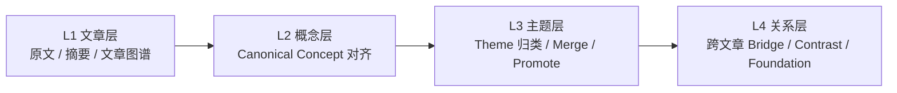
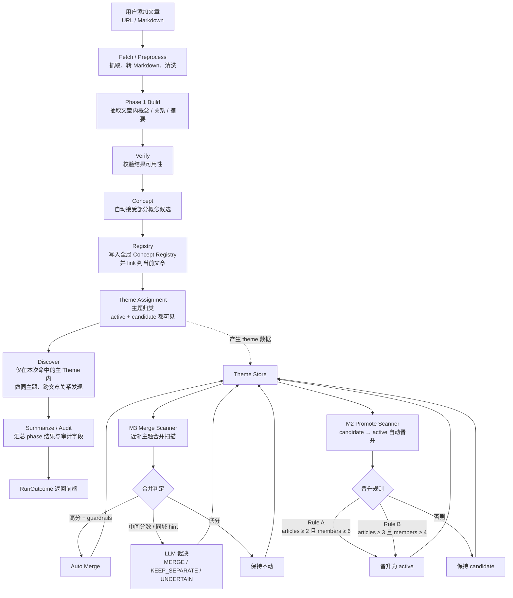

<div align="center">

# Knowledge Fabric

**A Knowledge Workspace for Research and Insight**

<em>把文章和文档变成可浏览的知识图谱与知识工作台</em>

[English](./README-EN.md) | [中文文档](./README.md)

</div>

## 简介

Knowledge Fabric 是一个将文章或 Markdown 文档导入后，为其构建知识图谱、并在工作台中浏览项目知识的系统。

它可以：

- 导入文章或 Markdown 文档
- 为每个项目生成知识图谱和阅读结构
- 在工作台中浏览项目内的概念、主题和跨文关系
- 查看全局概念注册表与主题枢纽

### 整体架构一览


整体架构围绕四个核心阶段展开：从文本中抽取结构，在结构中整理主线，在主线之间建立联结，最终形成可持续生长的知识网络。

- **非结构化文本**：文章、笔记、报告等原始材料进入系统，保留真实语境与信息细节。
- **语义图谱**：系统从文本中抽取概念及其关系，将零散表述转化为可操作的语义结构。
- **阅读骨架**：进一步整理文章的核心脉络，突出问题、方案、架构等关键节点，让内容更易理解。
- **知识网络**：将不同文章中的概念、观点、方法与证据联结起来，沉淀为可追溯、可扩展的长期知识资产。

> Knowledge Fabric 关注的不是”存了多少内容”，而是能否把内容编织成结构，把结构沉淀为网络，把网络转化为认知。

## 系统架构与处理流程

### 四层知识模型



### 主处理流水线



### 为什么不对所有主题两两做关系发现？

```mermaid
flowchart TD
    A[为什么现在不做'所有 Theme 两两 Discover'？] --> B[因为成本会变成 O&#40;N²&#41;]
    B --> C[Theme 多了以后<br/>token 与延迟都会爆]
    C --> D[当前策略：<br/>只在同 Theme 内增量 Discover]
    D --> E[先靠 M2 / M3 把知识尽量收拢到少量稳定 Theme]
    E --> F[等确有必要，再做 P3：<br/>只扫 Top-K 邻居 Theme，而非全量互跑]
```



当前采用**同主题增量发现**策略：每次处理时只在本次命中的主 Theme 内，对同主题的已有文章做跨文章关系发现。这避免了 O(N²) 的全量主题对扫描。主题治理（M2 晋升 + M3 合并）会持续把知识收拢到少量稳定主题，为未来按需扩展到 Top-K 邻居扫描打好基础。

## 当前版本

当前仓库是 Knowledge Fabric 的 **Preview 版本**。文章导入、图谱构建、项目工作台，以及全局概念 / 主题浏览已可用；部分审核与演化页面仍是原型。

## 快速开始

### 前置要求

| 工具 | 版本 | 检查 / 安装 |
|------|------|-------------|
| Node.js | 18+ | `node -v` / <https://nodejs.org/> |
| Python | 3.11 – 3.12 | `python3 --version` |
| uv | 最新 | `curl -LsSf https://astral.sh/uv/install.sh \| sh` |
| Neo4j | 5.26+ | 下方 Docker 一键启动，或 [Neo4j Desktop](https://neo4j.com/download/) |

启动一个本地 Neo4j（Docker 最简单）：

```bash
docker run -d \
  --name knowledge-fabric-neo4j \
  -p 7474:7474 -p 7687:7687 \
  -e NEO4J_AUTH=neo4j/graphiti123 \
  -v $HOME/neo4j-data:/data \
  neo4j:5.26
```

### 1. 克隆并配置环境变量

```bash
git clone https://github.com/searchbb/knowledge-fabric.git
cd knowledge-fabric
cp .env.example .env
```

编辑 `.env`，最小可运行配置：

```env
# LLM（OpenAI 兼容；也可换成任意 OpenAI 兼容网关）
LLM_API_KEY=sk-xxxxxxxx
LLM_BASE_URL=https://api.openai.com/v1
LLM_MODEL_NAME=gpt-4o-mini

# Neo4j
NEO4J_URI=bolt://localhost:7687
NEO4J_USER=neo4j
NEO4J_PASSWORD=graphiti123
```

完整字段见 [`.env.example`](./.env.example)。

### 2. 安装依赖

```bash
npm run setup:all
```

> 如果需要「阅读视图截图」功能，额外执行：
>
> ```bash
> cd backend && uv run playwright install chromium
> ```

### 3. 启动

```bash
npm run dev
```

- 前端：<http://localhost:3000>
- 后端 API：<http://localhost:5001>

## 验证首次成功运行

1. 打开 <http://localhost:3000/workspace/overview>，能看到工作台总览页即说明前端与 `/api/*` 代理已就绪。
2. 如果页面提示 Neo4j 未连接，检查 `docker ps` 中 Neo4j 容器是否在跑、`.env` 里的口令是否和容器一致。
3. 在导入入口或自动处理队列粘贴一个 URL，或上传一份 Markdown，等待图谱生成。
4. 项目生成后，进入该项目即可在工作台中查看文章图谱、概念、主题候选与跨文关系。

## 主要入口

| 页面 | 路径 |
|------|------|
| 工作台总览 | `/workspace/overview` |
| 概念注册表 | `/workspace/registry` |
| 主题枢纽 | `/workspace/themes` |
| 项目工作台 | `/workspace/:projectId` |

## Docker 部署

```bash
cp .env.example .env
docker compose up -d --build
```

默认读取根目录 `.env`，映射 `3000`（前端）/ `5001`（后端）。

当前 `docker-compose.yml` 只启动应用容器，Neo4j 仍需你自行准备，并在 `NEO4J_URI` 中指向它（macOS / Windows 可使用 `host.docker.internal:7687`）。

## 运行测试

推荐先跑不依赖外部服务的子集：

```bash
cd backend
uv run pytest -q \
  --ignore=tests/test_graph_builder_normalization.py \
  --ignore=tests/test_theme_attach_detach_audit.py \
  --ignore=tests/test_e2e_registry_flows.py \
  --ignore=tests/test_evolution_log_api.py
```

完整测试（需要真实 Neo4j 和 LLM 在线调用）：

```bash
uv run pytest -q
```

## 常见问题

| 现象 | 原因 | 处理 |
|------|------|------|
| 前端 `port 3000 is already in use` | 3000 端口被占用 | 修改 `frontend/vite.config.js` 的 `server.port`，并在 `.env` 设置 `KNOWLEDGE_WORKSPACE_FRONTEND=http://localhost:<新端口>` |
| 后端 `ModuleNotFoundError: graphiti_core` | Python 依赖未安装 | 确认 `uv sync` 已执行；启动用 `uv run python run.py` 或激活 `backend/.venv`，不要直接用系统 `python3` |
| 后端连 Neo4j 报 `ServiceUnavailable` | Neo4j 未启动或口令不匹配 | `docker ps \| grep neo4j`；必要时 `docker logs knowledge-fabric-neo4j` |
| 阅读视图截图 `ERR_CONNECTION_REFUSED` | 前端不在 3000 端口，或 playwright 浏览器未安装 | 确认 `npm run frontend` 已启动；执行 `cd backend && uv run playwright install chromium` |
| LLM 401 / 404 | `LLM_BASE_URL` / `LLM_MODEL_NAME` 与 key 不匹配 | 按网关文档核对；OpenAI 官方为 `https://api.openai.com/v1` + `gpt-4o-mini` |

## 已知限制

- 审核与演化页面目前仍是原型
- 部分后端测试依赖真实的 Neo4j 和 LLM

## 反馈

欢迎通过 GitHub Issues / PR 反馈问题与改进建议。

## 许可证

AGPL-3.0，详见 [LICENSE](./LICENSE)。
